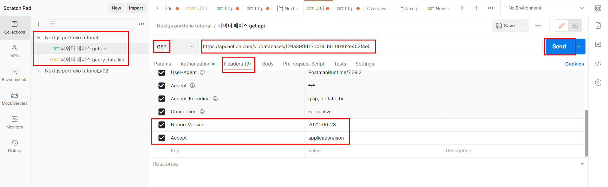

# Notion API

## 1. 노션 > 회원가입 > 로그인

```
https://www.notion.so/ko-kr/
```

<br><hr><br>

## 2. 페이지 추가 (좌측)

- Title : 프로젝트 모음 데이터베이스
- 명령어 : /data
- - /data를 입력한 후, 자동으로 뜨는 목록 중 "데이터베이스-인라인" 선택

<br><hr><br>

## 3. notion API doc 에서 integration 만들기

```
https://developers.notion.com/
```

- get started > Create a new integration

```
name : Next.js portfolio tutorial

설정 값
Integration type : Internal integration

Capability : Read content
+ comment capability : Read contents

User capability : No user information
```

<br><hr><br>

## 4. 연동을 위한 환경설정

- root/.env.local 파일 생성
- 토큰과 데이터베이스 ID 적어주기
- 토큰 : Notion API에서 "view my integration"을 보면 확인 가능 --> copy
- 데이터베이스 ID : notion에서 "open as full page" 클릭 후 url 전반부
- https://www.notion.so/f29a39ffd77c4741bb100162e452f4e5?v=22e131a728614e378512b7705f21a57a 이 중 "f29a39ffd77c4741bb100162e452f4e5"

```
NOTION_TOKEN="secret_ABAQRJareQA8EHnG4W4Wqa7lACf3k0PT99zB6NTA5DJ"
NOTION_DATABASE_ID="f29a39ffd77c4741bb100162e452f4e5"
```

## 5. PostMan 설치 (서버 요청)

- 개발자들이 API를 디자인하고 빌드하고 테스트하고 반복하기 위한 API 플랫폼이다

```
https://www.postman.com/downloads/
```




## 6. postman 에서 출력되는 코드 --> json formatter

```
https://jsonformatter.curiousconcept.com/#
```

- 코드 붙여 넣고 + process
